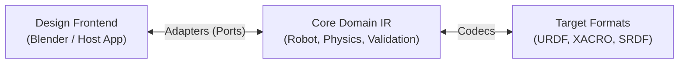
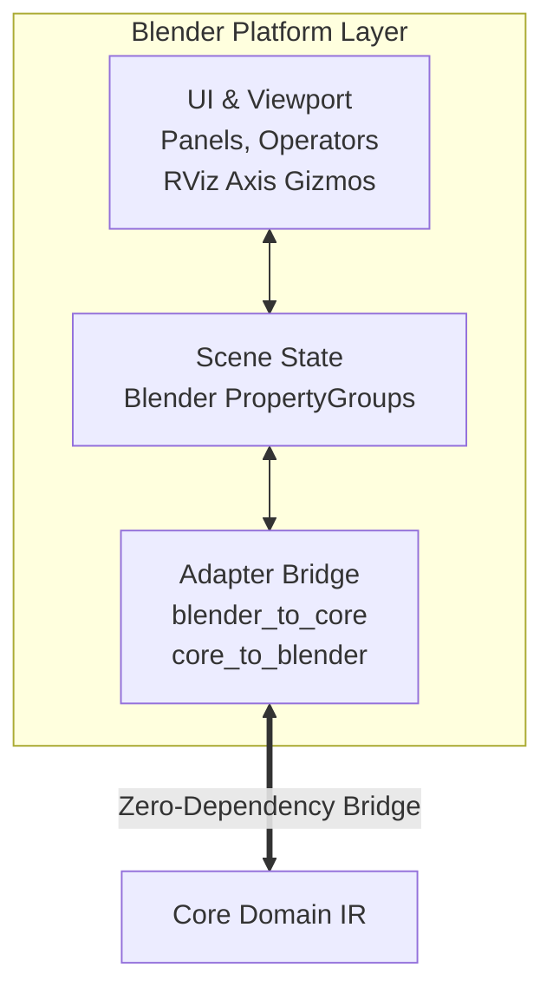
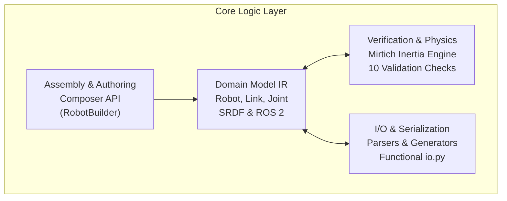
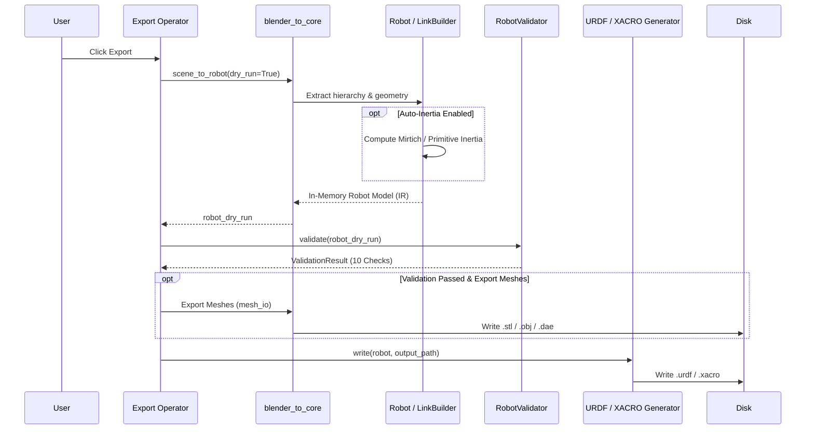

# LinkForge Architecture: The Programmable Robot Description Engine

This document provides a high-level map of LinkForge's architecture. It is designed to help contributors understand the **Frontends → IR → Backends** philosophy and the flow of data between design tools and simulation targets.

## Architectural Philosophy: Hexagonal Core
LinkForge is built on the **Ports & Adapters (Hexagonal)** pattern. The goal is to keep the "Robotics Intelligence" (Core) completely isolated from any specific "Design Tool" (Blender/FreeCAD).

1.  **The Design Frontend**: Host UI and viewport where users model robots visually.
2.  **The Core (IR)**: Zero-dependency Python logic representing the source of truth for topology, physics (Mirtich/Sylvester), and validation.
3.  **The Target Formats**: Standards-compliant robot description files for simulation (Gazebo, Isaac Sim) and motion planning (MoveIt, ROS 2).

## Module Structure

### 1. Platform Layer (`platforms/blender/`)
Handles host-specific UI, viewport visualization, scene state, and bidirectional bridging to the Core.

*   **UI & Viewport (`panels/`, `visualization/`, `operators/`)**: Renders native Blender panels, registers GPU draw handlers for RViz-style coordinate frames and inertia ellipsoids, and triggers actions.
*   **Scene State (`properties/`, `handlers/`)**: Stores typed metadata on Blender objects (`PropertyGroup`) and synchronizes scene updates (such as name changes).
*   **Adapter Bridge (`adapters/`, `logic/`)**: Translates bidirectionally between Blender objects and the Core IR, handling mesh extraction, transform baking, and collision hull synthesis.

### 2. Core Logic Layer (`core/src/linkforge/core/`)
The platform-independent heart of the project. **Strictly Zero-Dependency.**

*   **Domain Model IR (`models/`)**: Pure-Python dataclasses defining the unified intermediate representation (robot kinematics, geometry, materials, sensors, MoveIt semantics (SRDF), and ROS 2 control).
*   **Assembly & Authoring (`composer/`)**: Fluent builder API (`RobotBuilder`, `LinkBuilder`, `SemanticBuilder`) for assembling and composing robots programmatically.
*   **Verification & Physics (`physics/`, `validation/`)**: High-fidelity Mirtich polyhedral mass integration, Sylvester positive semi-definiteness checks, and 10 modular `RobotValidator` verification rules.
*   **I/O & Serialization (`parsers/`, `generators/`, `io.py`)**: Lossless XML parsing, macro resolution (XACRO), code generation, and high-level functional entry points (`read_urdf`, `write_urdf`, `validate_robot`).

## Data Workflows

### The "Bridge" Flow (Blender ➜ Robot Model Export)
How LinkForge converts design intent into physical parameters and exports verified robot descriptions.

## Core Engineering Principles

| Principle | Description |
| :--- | :--- |
| **Physics is Truth** | We prioritize numerical accuracy. If a mesh is broken, the linter "Fails in Editor" rather than "Fails in Sim." |
| **Zero-Dependency** | The Core must remain lightweight and portable. No NumPy or C++ dependencies in the simulation logic. |
| **Bake the Transforms** | To prevent "Origin Drift" between tools, we automatically normalize and bake transforms during import/export. |
| **Resilient Parsing** | Our URDF parser is "Lossless" - it preserves unknown tags and handles malformed XML gracefully. |

## Performance & Security
*   **Numerical Stability**: We use local origin-shifting (numerical conditioning) for all inertia integrals.
*   **Linear Scaling**: Inertia and Topology checks scale linearly with vertex/triangle count ($O(V+T)$).
*   **Resource Guards**: Hard limits on XML nesting (2000 levels) and file sizes (100MB) to prevent resource exhaustion attacks.

**Last Updated:** 2026-09-16
**Version:** 1.5.3
