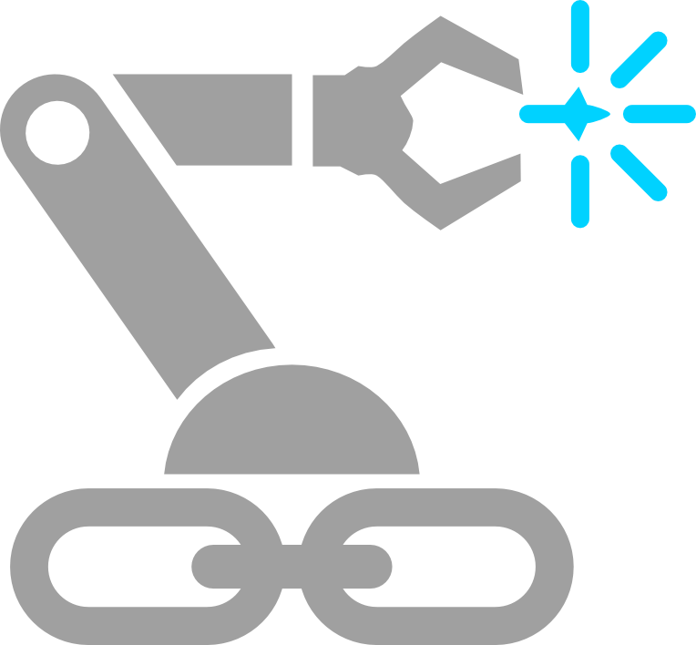

<div align="center">
  
</div>

# LinkForge

**The Programmable Robot Description Engine**

[](https://github.com/arounamounchili/linkforge/releases/latest)
[](https://github.com/arounamounchili/linkforge/actions)
[](https://linkforge.readthedocs.io/en/latest/)
[](https://www.gnu.org/licenses/gpl-3.0)
[](https://www.blender.org/download/)
[](https://www.conventionalcommits.org)

Writing and maintaining robot descriptions in URDF or SRDF is fragile by design. Inertia values are guessed by hand, collision geometries drift from visual meshes, and physics bugs are discovered only after export (or worse, on physical hardware).

**LinkForge treats your robot as source code, not a static document.**

Define it programmatically, validate rigid-body physics before export, and compile safely to any standard target. Whether you are building a single prototype in Blender or generating thousands of variants in a headless RL training loop, LinkForge is the validation layer between your design intent and your simulation.

## Why LinkForge?

| Feature | Legacy Exporters | LinkForge |
| :--- | :--- | :--- |
| **Architecture** | Monolithic / Tied to one CAD tool | **Hexagonal / Multi-Host & Multi-Target** |
| **Validation** | Post-Export (Fail in Sim) | **Automated Linting (Fail in Editor / CI)** |
| **Physics** | "Close Enough" Mesh Export | **Scientific Inertia & Mass Integrity** |
| **Composition** | Manual URDF merging | **Safe Programmatic Assembly with Namespace Resolution** |
| **Control** | Manual `ros2_control` XML | **Centralized Dashboard with auto-generation** |
| **Fidelity** | One-way export | **Round-Trip Precision (Import → Edit → Export)** |
| **ML Integration** | GUI-dependent tooling | **Headless `linkforge-core` for cluster / RL pipelines** |

> [!TIP]
> For a deep dive into our long-term technical strategy and the IR philosophy, see **[VISION.md](VISION.md)**.

## Quick Start

### Headless Core (CI / ML Pipelines / Scripting)

```bash
pip install linkforge-core
```

```python
from linkforge.core import RobotBuilder, box, cylinder

# 1. Build a robot programmatically
builder = RobotBuilder("my_arm")

builder.link("base_link") \
    .visual(box(0.5, 0.5, 0.1)) \
    .collision() \
    .mass(5.0) \
    .root()

builder.link("arm_link", parent="base_link") \
    .visual(cylinder(radius=0.05, length=0.4), xyz=(0, 0, 0.2)) \
    .collision() \
    .mass(1.0) \
    .revolute(axis=(0, 0, 1), xyz=(0, 0, 0.05), limits=(-3.14, 3.14)) \
    .commit()

# 2. Validate: catches disconnected links, kinematic loops, non-physical inertias
robot = builder.build(validate=True)

# 3. Compile to standard targets
urdf_xml = builder.export_urdf()
srdf_xml = builder.export_srdf()
```

### Modular Assembly

Compose validated sub-assemblies from reusable robot components:

```python
from linkforge.core import RobotBuilder, read_urdf

base_builder  = RobotBuilder(robot=read_urdf("mobile_base.urdf"))
arm_builder   = RobotBuilder(robot=read_urdf("manipulator.urdf"))

# Attach arm onto the base, auto-resolving naming conflicts
base_builder.attach(
    arm_builder,
    at_link="top_plate",
    prefix="left_arm_",
    xyz=(0, 0, 0.1),
)

# Add a MoveIt 2 planning group for the combined assembly
base_builder.semantic.group(
    "arm_chain",
    base_link="top_plate",
    tip_link="left_arm_end_effector",
)

robot = base_builder.build(validate=True)
urdf_xml = base_builder.export_urdf()
srdf_xml = base_builder.export_srdf()
```

### Blender Visual Designer (Full Platform)

Design robots visually in Blender - all physics validation and export pipelines are backed by the same `linkforge-core` engine. See the **[Installation](#-installation)** section below to set it up.

## Technical Specifications

| Feature | Support | Details |
| :--- | :--- | :--- |
| **Links** | ✅ Full | Visual/Collision Geometry, Materials, Automatic Physics |
| **Joints** | ✅ Full | All 6 types (Fixed, Revolute, Prismatic, etc.) + **Mimic Joints** |
| **Sensors** | ✅ Full | Camera, LiDAR, IMU, GPS, **Contact**, **Force/Torque** |
| **Control** | ✅ Full | `ros2_control` Dashboard & Gazebo Plugin Integration |
| **Validation** | ✅ Pro | Kinematic linter catches topology errors, disconnected links, non-physical inertias |
| **Fidelity** | ✅ Pro | **Round-Trip Precision** for lossless Import → Edit → Export |
| **Formats** | ✅ Full | URDF 1.0, XACRO (Macros, Properties, Multi-file), **SRDF (MoveIt 2)** |
| **Headless** | ✅ Full | Zero-dependency `linkforge-core` runs in CI/CD, HPC clusters, RL training loops |
| **Composition** | ✅ Full | Modular assembly via `attach()` with automatic prefix-based namespace resolution |
| **Physics** | ✅ Full | Scientifically accurate inertia tensor calculation for primitives and arbitrary meshes |

## Installation

### Headless Python Core

**Requirements**: Python 3.11+

```bash
pip install linkforge-core
```

No Blender, no GUI dependencies. Full Composer API, parsers, generators, validators, and physics engine.

### Blender Visual Designer

**Requirements**: Blender 4.2 or later

#### Method 1: Blender Extensions (Recommended)
1. Open Blender → **Edit › Preferences › Get Extensions**
2. Search for **"LinkForge"**
3. Click **Install**

#### Method 2: Split-Platform ZIP (Current Stable)
1. Download the `.zip` for your specific platform (e.g., `linkforge-blender-x.x.x-macos_arm64.zip`) from [Latest Releases](https://github.com/arounamounchili/linkforge/releases/latest).
2. Open Blender → **Edit › Preferences › Extensions**.
3. Click the arrow icon (⌄) in the top right → **Install from Disk**.
4. Select the downloaded `.zip` file and click **Install**.
5. Enable the extension in the list.

#### Method 3: Development Mode (For Contributors)
```bash
git clone https://github.com/arounamounchili/linkforge.git
cd linkforge
just install
just develop  # Links workspace into Blender for live development
```

## Using the Blender Visual Designer

### Creating a Robot from Scratch

1. **Create Links**: Select a mesh → **Forge** panel → **Create Link**. Configure mass, inertia, and collision geometry in the **Physics** section.
2. **Connect with Joints**: Select child link → **Forge** panel → **Create Joint**. Set type, limits, axis, and dynamics.
3. **Add Sensors** *(Optional)*: Select a link → **Perceive** panel → **Add Sensor**.
4. **Configure Control** *(Optional)*: Go to **Control** panel → Enable **Use ROS2 Control** → configure command/state interfaces.
5. **Validate & Export**: **Validate & Export** panel → click **Validate Robot** → choose URDF/XACRO/SRDF → click **Export**.

### Importing Existing URDF

1. Open the **LinkForge** sidebar tab (N-panel in 3D Viewport).
2. In the **Forge** panel, click **Import URDF/XACRO**.
3. Select your file and edit the robot structure normally.
4. Export back via the **Validate & Export** panel.

## Examples & Documentation

### Example Files

Complete examples in the `examples/` directory:

| File | Description |
| :--- | :--- |
| `urdf/mobile_robot.urdf` | Simple mobile robot base |
| `urdf/diff_drive_robot.urdf` | Differential drive robot with wheels |
| `urdf/quadruped_robot.urdf` | 4-legged robot demonstrating complex kinematic chains |

Programmatic tutorials in the documentation:
- **Parametric Robotic Arm** - Build a fully-jointed manipulator from mathematical definitions using `RobotBuilder`.
- **Modular Differential Drive** - Compose a chassis with automated wheel spacing, track calculations, and SRDF collision matrices.

### Documentation Links

- **[User Guide](https://linkforge.readthedocs.io/en/latest/tutorials/index.html)** - Comprehensive tutorials and getting started.
- **[API Reference](https://linkforge.readthedocs.io/en/latest/reference/api/index.html)** - Technical reference for the `linkforge-core` library.
- **[Architecture Guide](https://linkforge.readthedocs.io/en/latest/explanation/ARCHITECTURE.html)** - System design, Hexagonal Core, and data flow.
- **[CHANGELOG](CHANGELOG.md)** - Version history.

## Roadmap

### Phase 1: Professional Foundation (Current)
- [x] **v1.0-v1.2**: Core URDF/XACRO export, Sensors, `ros2_control`, and Hexagonal Architecture.
- [x] **v1.3.0**: Performance & Control (Depsgraph, ROS 2 Control enhancements).
- [x] **v1.4.0**: Headless core decoupling, Composer API, Namespaced Merging, and MoveIt 2 SRDF generation.
- [ ] **v1.5.0**: SRDF Configuration Panel to expose existing SRDF generation to the Blender UI (Planning Groups, End Effectors).
- [ ] **v1.6.0**: LinkForge CLI & GitHub Actions for automated validation in CI pipelines.

### Phase 2: Universal Interoperability (Upcoming)
- [ ] **v2.0.0**: Official specification of the **`.lf` File Standard** - a lossless, source-level IR for robotics.
- [ ] **v2.1.0**: Native MuJoCo/MJCF exporter.
- [ ] **v2.2.0**: Native Gazebo/SDF exporter.

### Phase 3: AI & Ecosystem (Research)
- [ ] **v3.0+**: AI-assisted kinematic rigging, LinkForge Package Manager (LPM), and cloud-native `lf://` URI resolution.

## Development

```bash
# 1. Install 'just' command runner (see Contributing Guide for OS-specific instructions)
# 2. Clone repository
git clone https://github.com/arounamounchili/linkforge.git
cd linkforge

# 3. Install dependencies and setup venv
just install

# 4. Link to Blender for live development
just develop
```

For complete instructions on testing, linting, and building, see our [Contributing Guide](CONTRIBUTING.md).

## Contributing

We welcome contributions! LinkForge is a community-driven project.
- Review our [Contributing Guide](CONTRIBUTING.md).
- Check our [Architecture](ARCHITECTURE.md) to understand the internals.
- Join the conversation on [GitHub Discussions](https://github.com/arounamounchili/linkforge/discussions).

## Citing LinkForge

If you use LinkForge in academic research, please cite it using the provided `CITATION.cff` file. You can find the citation format in the "Cite this repository" button on GitHub's sidebar.

## License

LinkForge follows a **Split-License Model** designed for both community-driven innovation and industrial-scale integration:

- **`linkforge-core` (The Engine)**: Licensed under the **Apache License 2.0**. This permissive license allows industrial partners to integrate the core engine into proprietary pipelines and commercial products.
- **`platforms/blender` (The UI)**: Licensed under the **GNU General Public License v3.0**. This ensures the visual modeling experience and its community-driven improvements remain open-source.

For more details, see the [LICENSE](LICENSE) (GPL) and [core/LICENSE](core/LICENSE) (Apache) files.
For third-party component licenses, see [THIRD-PARTY-NOTICES.md](THIRD-PARTY-NOTICES.md).

## Our Contributors

Thanks goes to these wonderful people ([emoji key](https://allcontributors.org/docs/en/emoji-key)):

<!-- ALL-CONTRIBUTORS-LIST:START - Do not remove or modify this section -->
<!-- prettier-ignore-start -->
<!-- markdownlint-disable -->
<table>
  <tbody>
    <tr>
      <td align="center" valign="top" width="14.28%"><a href="https://github.com/arounamounchili"><br /><sub><b>arounamounchili</b></sub></a><br /><a href="https://github.com/arounamounchili/linkforge/commits?author=arounamounchili" title="Code">💻</a> <a href="#design-arounamounchili" title="Design">🎨</a> <a href="#ideas-arounamounchili" title="Ideas, Planning, & Feedback">🤔</a> <a href="#maintenance-arounamounchili" title="Maintenance">🚧</a></td>
      <td align="center" valign="top" width="14.28%"><a href="https://github.com/MagnusHanses"><br /><sub><b>MagnusHanses</b></sub></a><br /><a href="https://github.com/arounamounchili/linkforge/issues?q=author%3AMagnusHanses" title="Bug reports">🐛</a></td>
      <td align="center" valign="top" width="14.28%"><a href="https://github.com/GeorgeKugler"><br /><sub><b>GeKo-8</b></sub></a><br /><a href="https://github.com/arounamounchili/linkforge/issues?q=author%3AGeorgeKugler" title="Bug reports">🐛</a></td>
      <td align="center" valign="top" width="14.28%"><a href="https://github.com/andreas-loeffler"><br /><sub><b>Andreas Loeffler</b></sub></a><br /><a href="https://github.com/arounamounchili/linkforge/commits?author=andreas-loeffler" title="Code">💻</a> <a href="https://github.com/arounamounchili/linkforge/commits?author=andreas-loeffler" title="Tests">⚠️</a></td>
      <td align="center" valign="top" width="14.28%"><a href="https://www.mec.ed.tum.de/en/iwb/staff/research-team-assembly-technology-and-robotics/mueller-julian/"><br /><sub><b>Julian Müller</b></sub></a><br /><a href="#ideas-julianmueller" title="Ideas, Planning, & Feedback">🤔</a> <a href="https://github.com/arounamounchili/linkforge/commits?author=julianmueller" title="Tests">⚠️</a> <a href="https://github.com/arounamounchili/linkforge/pulls?q=is%3Apr+reviewed-by%3Ajulianmueller" title="Reviewed Pull Requests">👀</a></td>
      <td align="center" valign="top" width="14.28%"><a href="https://cmp.felk.cvut.cz/~peckama2/"><br /><sub><b>Martin Pecka</b></sub></a><br /><a href="https://github.com/arounamounchili/linkforge/issues?q=author%3Apeci1" title="Bug reports">🐛</a> <a href="#ideas-peci1" title="Ideas, Planning, & Feedback">🤔</a></td>
      <td align="center" valign="top" width="14.28%"><a href="https://github.com/nulcode-lab"><br /><sub><b>Lionel Fung</b></sub></a><br /><a href="https://github.com/arounamounchili/linkforge/issues?q=author%3Anulcode-lab" title="Bug reports">🐛</a></td>
    </tr>
    <tr>
      <td align="center" valign="top" width="14.28%"><a href="https://linktr.ee/razcore.rad"><br /><sub><b>Răzvan C. Rădulescu</b></sub></a><br /><a href="https://github.com/arounamounchili/linkforge/issues?q=author%3Arazcore-rad" title="Bug reports">🐛</a> <a href="https://github.com/arounamounchili/linkforge/commits?author=razcore-rad" title="Tests">⚠️</a></td>
    </tr>
  </tbody>
</table>

<!-- markdownlint-restore -->
<!-- prettier-ignore-end -->

<!-- ALL-CONTRIBUTORS-LIST:END -->

This project follows the [all-contributors](https://github.com/all-contributors/allcontributors.org) specification. Contributions of any kind welcome!

<p align="center">
  <b>Made with ❤️ for roboticists worldwide</b><br/>
  <i>Precision engineering meets creative modeling.</i>
</p>
