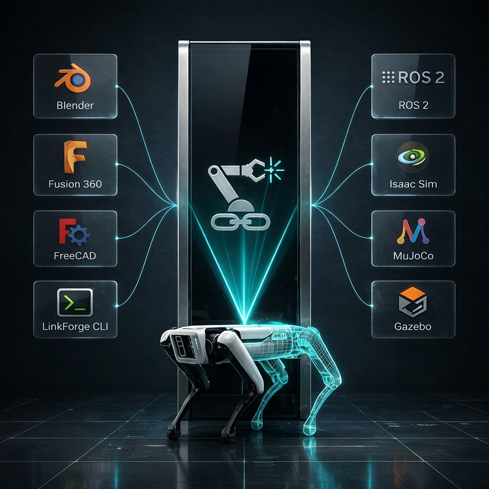

# LinkForge: The Missing Link in Robotics



## Mission

**Today**: LinkForge provides a programmable Intermediate Representation (IR) for robotics. It acts as a rigorous Python engine to build, validate, and compile robot descriptions without writing XML by hand. It runs headlessly in CI pipelines and ML training clusters, and visually through a native Blender integration.

**Tomorrow**: We are designing the `.lf` Intermediate Representation (IR). This lossless JSON/YAML format preserves design intent across the full development lifecycle: from any parametric CAD model to multi-physics simulation and physical hardware deployment.

## The Core Problem: Executables vs. Source Code

The robotics ecosystem currently treats formats like URDF, SDF, and MJCF as the **source of truth** for robot descriptions. This is a fundamental architectural mistake.

These formats are actually **"Executables"**, meaning they are lossy, environment-specific snapshots compiled from opaque CAD tools. When you export a robot to URDF, you are performing a destructive, one-way compilation step. If you manually fix an inertia value in the XML, you cannot "decompile" that change back to your design model. Your intent is permanently lost.

### The Consequences at Scale

This is manageable with a single robot and one developer. It breaks down under:

| Scenario | How It Breaks |
| :--- | :--- |
| Multi-link assemblies (>50 links) | Inertia errors accumulate silently; discovered only when the simulator diverges |
| Modular robot design | Merging two URDF files by hand causes naming collisions and kinematic disconnects |
| RL training with domain randomization | Generating thousands of robot variants programmatically is unsafe without a validation layer |
| Multi-person team | No single source of truth; XML files drift between engineers |
| Sim-to-Real deployment | A physics error that passes the simulator crashes on the physical actuator |

### The LinkForge Answer

LinkForge introduces a layer between design intent and format compilation. Instead of editing XML directly, you write Python that builds a validated **Intermediate Representation (IR)**, which is then compiled to whichever format your pipeline requires.

```
Design (Python API / Blender)
         ↓
  LinkForge IR + Linter
         ↓
URDF / SRDF / MJCF / SDF
         ↓
ROS 2 / MuJoCo / Gazebo / Hardware
```

The IR is the "source code." URDF is the compiled output.

## Who Uses LinkForge

LinkForge serves distinct audiences with different primary needs. We design features specifically for each:

| Audience | Their Pain | LinkForge Solution |
| :--- | :--- | :--- |
| **Hardware Engineers & Researchers** | Physics errors (inertia, mass) reach hardware too late | Linter catches structural and physical impossibilities before export |
| **AI & RL Practitioners** | Generating thousands of robot variants safely at scale is hard | Headless `linkforge-core` enables deterministic programmatic mutation in cluster environments |
| **Robotics Startups** | Robot descriptions break as the team and robot complexity grow | Programmable IR provides one authoritative, testable source of truth |
| **Open-Source Community** | Sharing reproducible, physically-correct robot models is still manual | Headless linter and CI/CD generation ensures shared components are verified |

## Scientific Integrity as a First Principle

LinkForge is built around one conviction:

> **Physics is Truth.** If a robot model is physically impossible, the linter should fail in your editor — not after deployment on hardware.

This shapes every design decision:

- **Inertia is computed, not estimated**: We use Mirtich and Sylvester algorithms to calculate rigid-body inertia tensors directly from mesh geometry. There is no "close enough."
- **Topology is verified**: The kinematic graph is checked for disconnected links, missing root nodes, and cycles before any export step.
- **Transforms are baked**: We automatically normalize and bake coordinate transforms during import/export to prevent "origin drift" between tools.
- **Malformed XML is rejected gracefully**: The parser uses resource guards (nesting limits, file size limits) to prevent malformed input from causing resource exhaustion.

## Technical Strategy: The Hexagonal Core

LinkForge uses a **Ports & Adapters (Hexagonal) Architecture** to keep the physics and IR logic completely isolated from any specific design tool or simulator:

```
     [Blender Platform]     [Python Scripts / CI]
            |                        |
     [Platform Adapters]     [linkforge-core API]
            |                        |
       ┌────────────────────────────────────────┐
       │           linkforge-core               │
       │  Models · Composer · Physics · IO      │
       │  Parsers · Generators · Validation     │
       └────────────────────────────────────────┘
            |                        |
       [URDF / XACRO]        [SRDF / MJCF / SDF]
```

- **The Core** (`linkforge-core`): Zero-dependency Python. Contains all physics logic, the IR data models, parsers, generators, and the validation engine.
- **The Platform Layer**: Thin adapters that translate host-specific data (e.g., Blender mesh geometry, object properties) into Core IR models.
- **The Headless Strategy**: Because the core has zero GUI dependencies, it runs directly in CI pipelines, HPC clusters, and ML training loops for programmatic robot generation and domain randomization.

## The Competitive Edge

| Feature | Legacy Tooling | LinkForge Platform |
| :--- | :--- | :--- |
| **Architecture** | Monolithic / Tied to one CAD tool | **Hexagonal / Multi-Host & Multi-Target** |
| **Format** | XML-based, Lossy, Fragmented | **Programmatic IR → Standard targets** |
| **Validation** | Post-Export (Fail in Sim) | **Automated Linting (Fail in Editor or CI)** |
| **Physics** | "Close Enough" Mesh Export | **Scientific Inertia & Mass Sanity** |
| **Composition** | Manual XML merging | **Programmatic assembly with namespace resolution** |
| **ML Integration** | GUI-only workflows | **Headless core for cluster-scale RL pipelines** |

## Future Horizons

### The `.lf` Intermediate Representation (Phase 2 Roadmap)
The `.lf` file format is the next major milestone. It will serve as a universal, lossless **Intermediate Representation (IR)** for robotics. It is designed to be diffed in Git, reviewed in pull requests, and used as the definitive source of truth in CI/CD pipelines.

The `.lf` format acts as the bridge between CAD and simulation:
1. Export `.lf` from any supported CAD tool (Blender, SolidWorks, Fusion360).
2. Commit the `.lf` JSON/YAML to Git for clean code review.
3. `linkforge-core` compiles the `.lf` file headlessly into URDF, SRDF, MJCF, and SDF in GitHub Actions.

Key properties being designed:
- **Lossless round-trips**: Every export is perfectly invertible; no design intent is destroyed.
- **Metadata-rich**: Physical properties, design intent, and validation history are embedded.
- **Human-readable**: JSON/YAML-based so it is auditable and diffable without special tooling.

## Vision 2030: The Universal Connector

By 2030, we believe the robotics industry will transition from monolithic, hardcoded robot designs to a modular component ecosystem where specialized subsystems like legs, torsos, manipulators, and sensor heads can be integrated with confidence across platforms.

**LinkForge is the validation layer that makes this safe.**

By providing a universal Intermediate Representation that encodes physical constraints and design intent rather than just geometry, we enable a global ecosystem where any standard-compliant component can be integrated, validated, and deployed without friction.


> [!IMPORTANT]
> **LinkForge** is built for engineers who know that in robotics, **Physics is Truth**. We provide the validation infrastructure; you build the future.
