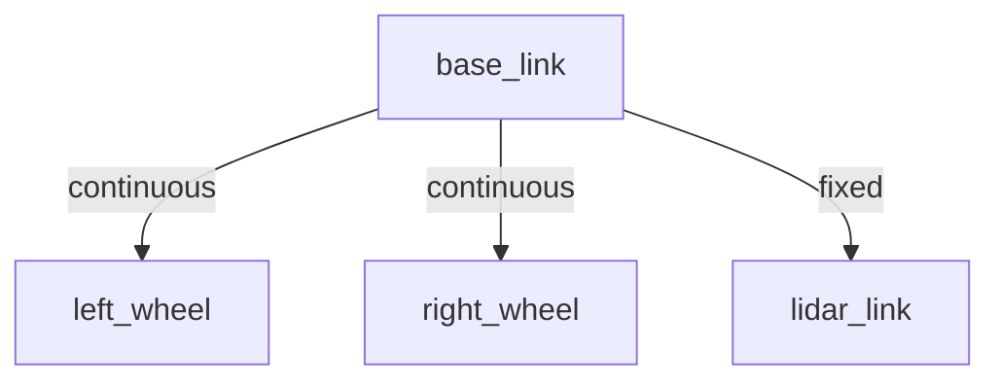

# Tutorial: Building a Differential Drive Robot (Programmatic)

In this tutorial, you will configure a complete differential drive mobile robot programmatically in Python using the standalone `linkforge-core` library. You will learn how to define links, joints, a LiDAR sensor, and `ros2_control` configurations, then export everything to a standardized URDF file.

## What You Will Learn
- How to initialize `RobotBuilder`.
- How to construct **Links** and **Joints** programmatically.
- How to configure joint limits and axes.
- How to attach a **LiDAR Sensor**.
- How to define **Control Interfaces** using `ros2_control`.
- How to **Validate** and **Export** URDF data.

---

## 🌳 Kinematic Tree

The structure of the robot we will construct is identical to the one modeled visually in Blender:



---

## Step 1: Install `linkforge-core`

Before writing code, ensure you have Python (version 3.11 or later) installed. Run:

```bash
pip install linkforge-core
```

---

## Step 2: Initialize `RobotBuilder`

The primary entry point for constructing robots programmatically is the `RobotBuilder`. Initialize it with a robot name:

```python
from linkforge.core import RobotBuilder

# Initialize a new robot builder named 'diff_drive'
builder = RobotBuilder("diff_drive")

# Configure a global ros2_control hardware system (required for joint controllers)
builder.ros2_control(
    name="DiffDriveSystem",
    hardware_plugin="mock_components/GenericSystem"
)
```

---

## Step 3: Create the Base Link

Next, define the base link (chassis) of our mobile robot. We will shape it using a solid box primitive and set its mass. Since it is the root of the robot's kinematic chain, we will chain `.root()`:

```python
from linkforge.core import box

# Create a box primitive for the chassis (dimensions: 0.4m x 0.3m x 0.1m)
chassis_geom = box(0.4, 0.3, 0.1)

# Stage the base_link using a context manager.
# Any links created inside the `with` block will automatically parent to `base_link`.
with builder.link("base_link").visual(chassis_geom).collision().mass(5.0).root():
```

::: {tip}
Calling `.collision()` without arguments automatically infers and creates an optimized collision mesh matching your visual geometry. Chaining `.mass(5.0)` automatically computes the physical inertia tensor for the link based on its geometry and mass.
:::

---

## Step 4: Create the Wheels & Configure Control

Now, add the left and right wheels. These will be continuous (unlimited rotation) joints. We will also configure `ros2_control` command and state interfaces on each wheel joint so they can be driven by a velocity controller:

```python
from linkforge.core import cylinder

# Create a cylinder primitive for the wheels (radius: 0.1m, length: 0.05m)
wheel_geom = cylinder(radius=0.1, length=0.05)

with builder.link("base_link").visual(chassis_geom).collision().mass(5.0).root():
    # 1. Left Wheel (parent automatically inferred as 'base_link')
    builder.link("left_wheel") \
        .visual(wheel_geom, rpy=(1.57, 0, 0)) \
        .collision() \
        .mass(0.5) \
        .continuous(
            axis=(0, 1, 0),
            xyz=(0.0, 0.175, 0.0),
            rpy=(0, 0, 0),
        ) \
        .ros2_control(
            command_interfaces=["velocity"],
            state_interfaces=["position", "velocity"],
        )
        # Note: when exiting a context manager, child links are automatically committed!

    # 2. Right Wheel
    builder.link("right_wheel") \
        .visual(wheel_geom, rpy=(1.57, 0, 0)) \
        .collision() \
        .mass(0.5) \
        .continuous(
            axis=(0, 1, 0),
            xyz=(0.0, -0.175, 0.0),
            rpy=(0, 0, 0),
        ) \
        .ros2_control(
            command_interfaces=["velocity"],
            state_interfaces=["position", "velocity"],
        )

    # 3. Lidar Link & Sensor
    lidar_geom = cylinder(radius=0.05, length=0.06)
    builder.link("lidar_link") \
        .visual(lidar_geom) \
        .collision() \
        .mass(0.2) \
        .fixed(xyz=(0.15, 0.0, 0.08)) \
        .lidar(
            name="chassis_laser",
            range_min=0.1,
            range_max=10.0,
            samples=360,
        )
```

---

## Step 6: Validate & Export

We are ready to validate our kinematic model and export the physical robot description (URDF):

```python
# Validate the assembled robot using the built-in validation engine
from linkforge.core import validate_robot

result = validate_robot(builder.robot)

if result.is_valid:
    print("✓ Robot is physically and structurally valid!")
else:
    print("✗ Validation failed:")
    for error in result.errors:
        print(f"  - {error.message}")
    exit(1)

# Export strictly-compliant URDF XML
urdf_xml = builder.export_urdf()
with open("diff_drive.urdf", "w") as f:
    f.write(urdf_xml)
print("✓ Successfully exported diff_drive.urdf!")
```

---

## Complete Python Script

Here is the complete, self-contained Python script to build, validate, and export the robot:

```python
from linkforge.core import RobotBuilder, box, cylinder, validate_robot

def build_robot():
    # Initialize builder
    builder = RobotBuilder("diff_drive")

    # Configure global ros2_control system
    builder.ros2_control(
        name="DiffDriveSystem",
        hardware_plugin="mock_components/GenericSystem"
    )

    # 1. Base link context
    with builder.link("base_link").visual(box(0.4, 0.3, 0.1)).collision().mass(5.0).root():

        # 2. Left wheel
        builder.link("left_wheel") \
            .visual(cylinder(0.1, 0.05), rpy=(1.57, 0, 0)) \
            .collision() \
            .mass(0.5) \
            .continuous(axis=(0, 1, 0), xyz=(0, 0.175, 0)) \
            .ros2_control(
                command_interfaces=["velocity"],
                state_interfaces=["position", "velocity"]
            )

        # 3. Right wheel
        builder.link("right_wheel") \
            .visual(cylinder(0.1, 0.05), rpy=(1.57, 0, 0)) \
            .collision() \
            .mass(0.5) \
            .continuous(axis=(0, 1, 0), xyz=(0, -0.175, 0)) \
            .ros2_control(
                command_interfaces=["velocity"],
                state_interfaces=["position", "velocity"]
            )

        # 4. LiDAR Link & Sensor
        builder.link("lidar_link") \
            .visual(cylinder(0.05, 0.06)) \
            .collision() \
            .mass(0.2) \
            .fixed(xyz=(0.15, 0, 0.08)) \
            .lidar(name="chassis_laser", range_min=0.1, range_max=10.0, samples=360)

    # Validate
    result = validate_robot(builder.robot)
    if not result.is_valid:
        print("Validation errors:")
        for err in result.errors:
            print(f"  - {err.message}")
        return

    # Export
    with open("diff_drive.urdf", "w") as f:
        f.write(builder.export_urdf())
    print("✓ Assembled and exported Robot URDF successfully!")

if __name__ == "__main__":
    build_robot()
```
