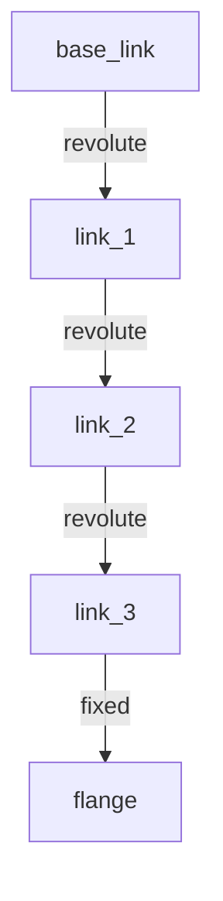

# Tutorial: Building a Parametric Serial Manipulator

In this tutorial, you will write a parametric Python script using the standalone `linkforge-core` library to dynamically construct an $N$-joint serial manipulator (robotic arm). You will configure revolute joints with limits, automatically compute inertia tensors, define a **MoveIt Planning Group** and named states using SRDF, and export both clean URDF and SRDF XML files.

## What You Will Learn
- How to write a **parametric Python function** to generate robots of any length.
- How to connect a deep sequential chain of links with revolute joints.
- How to configure **MoveIt Planning Groups (SRDF)** programmatically.
- How to define named **Group States** (e.g. "home", "vertical").
- How to programmatically **disable self-collisions** between adjacent links to optimize motion planning.

---

##  Kinematic Tree

Unlike a mobile robot (which has a flat kinematic tree), a robotic arm has a deep, sequential kinematic tree. For a 3-joint manipulator, the kinematic chain looks like this:



By using Python code instead of drawing joints visually in a CAD GUI, we can generate a robot with **any number of joints (N)** with a simple `for` loop!

---

## Step 1: Initialize the Builder & Base Link

First, let's create a new `RobotBuilder` and define a heavy cylindrical base link as the kinematic root of our arm:

```python
from linkforge.core import RobotBuilder, cylinder

# Initialize builder
builder = RobotBuilder("parametric_manipulator")

# Create a heavy cylindrical base link
builder.link("base_link") \
    .visual(cylinder(radius=0.1, length=0.08)) \
    .collision() \
    .mass(5.0) \
    .root()
```

---

## Step 2: Write the Parametric Generation Loop

Now, we will write a dynamic loop to stack links and revolute joints.
As we build up the chain:
1. Links closer to the base will be thicker and heavier.
2. Joints will alternate between rotating around the Z-axis (yaw) and Y-axis (pitch) to give the arm full range of motion.
3. The parent of each joint will be the previous link.

```python
num_joints = 6  # Let's generate a 6-DOF arm!
parent_link = "base_link"

for i in range(1, num_joints + 1):
    link_name = f"link_{i}"
    joint_name = f"joint_{i}"

    # Visual dimensions taper off along the chain
    length = 0.4 if i <= 2 else 0.3
    radius = 0.05 if i <= 2 else 0.03
    geom = cylinder(radius=radius, length=length)

    # Calculate decreasing mass along the chain for physical consistency
    mass = max(3.0 - (i * 0.4), 0.5)

    # Stack the joints on top of each other along the Z-axis
    offset_z = 0.04 if parent_link == "base_link" else length

    builder.link(link_name, parent=parent_link) \
        .visual(geom, xyz=(0, 0, length / 2)) \
        .collision() \
        .mass(mass) \
        .revolute(
            axis=(0, 0, 1) if i % 2 == 1 else (0, 1, 0),
            xyz=(0, 0, offset_z),
            limits=(-3.14, 3.14)
        ) \
        .commit()

    parent_link = link_name
```

---

## Step 3: Add a Tool Flange

At the tip of our last link, we add a lightweight fixed flange where a gripper or tool can be mounted:

```python
from linkforge.core import box

flange_name = "flange"

builder.link(flange_name, parent=parent_link) \
    .visual(box(0.04, 0.04, 0.02)) \
    .collision() \
    .mass(0.2) \
    .fixed(xyz=(0, 0, 0.3)) \
    .commit()
```

---

## Step 4: Configure MoveIt Semantic Data (SRDF)

To plan trajectories for our manipulator in MoveIt, we must define planning groups and states. Doing this in raw XML is tedious, but with `linkforge-core`, it is incredibly easy:

### 1. Define a Planning Group (Chain)
We define the arm group using the kinematic chain shorthand from `base_link` to `flange`:

```python
builder.semantic.group(
    name="arm",
    base_link="base_link",
    tip_link="flange"
)
```

### 2. Add named Group States (Poses)
We can save specific joint configurations with meaningful names (e.g. a "home" pose where all joints are at `0` radians):

```python
# Create a dictionary of joint angles
home_angles = {f"joint_{i}": 0.0 for i in range(1, num_joints + 1)}

# Save it as the 'home' group state
builder.semantic.group_state(
    name="home",
    group="arm",
    values=home_angles
)
```

### 3. Disable Consecutive Self-Collisions
Adjacent connected links are always in contact, so we should tell MoveIt's collision checker to ignore them to boost planning speeds:

```python
# Disable collisions between base and first link
builder.semantic.disable_collisions("base_link", "link_1")

# Disable collisions between consecutive arm links
for i in range(1, num_joints):
    builder.semantic.disable_collisions(f"link_{i}", f"link_{i+1}")

# Disable collisions between last link and flange
builder.semantic.disable_collisions(f"link_{num_joints}", "flange")
```

---

## Step 5: Validate and Export Both URDF and SRDF

Finally, we validate our generated URDF and SRDF data and export both files:

```python
from linkforge.core import validate_robot

# Validate
result = validate_robot(builder.robot)
if not result.is_valid:
    print("Validation failed:")
    for error in result.errors:
        print(f"  - {error.message}")
    exit(1)

# Export URDF
with open("manipulator.urdf", "w") as f:
    f.write(builder.export_urdf())

# Export SRDF
with open("manipulator.srdf", "w") as f:
    f.write(builder.export_srdf())

print(" Successfully exported manipulator.urdf and manipulator.srdf!")
```

---

## Complete Python Script

Here is the complete, self-contained Python script to build, validate, and export the parametric manipulator:

```python
from linkforge.core import RobotBuilder, cylinder, box, validate_robot

def build_parametric_arm(num_joints: int = 6):
    print(f"Generating a {num_joints}-DOF parametric robotic arm...")
    builder = RobotBuilder(f"arm_{num_joints}dof")

    # 1. Base link
    builder.link("base_link") \
        .visual(cylinder(radius=0.1, length=0.08)) \
        .collision() \
        .mass(5.0) \
        .root()

    # 2. Sequential joints & links
    parent_link = "base_link"
    for i in range(1, num_joints + 1):
        link_name = f"link_{i}"
        joint_name = f"joint_{i}"

        # Alternating link geometry size
        length = 0.4 if i <= 2 else 0.3
        radius = 0.05 if i <= 2 else 0.03
        geom = cylinder(radius=radius, length=length)

        # Diminishing mass
        mass = max(3.0 - (i * 0.4), 0.5)

        # Offset to place the joint at the end of the previous cylinder
        offset_z = 0.04 if parent_link == "base_link" else length

        builder.link(link_name, parent=parent_link) \
            .visual(geom, xyz=(0, 0, length / 2)) \
            .collision() \
            .mass(mass) \
            .revolute(
                axis=(0, 0, 1) if i % 2 == 1 else (0, 1, 0),
                xyz=(0, 0, offset_z),
                limits=(-3.14, 3.14)
            ) \
            .commit()

        parent_link = link_name

    # 3. Tool flange
    builder.link("flange", parent=parent_link) \
        .visual(box(0.04, 0.04, 0.02)) \
        .collision() \
        .mass(0.2) \
        .fixed(xyz=(0, 0, 0.3)) \
        .commit()

    # 4. Planning Groups (SRDF)
    builder.semantic.group(
        name="arm",
        base_link="base_link",
        tip_link="flange"
    )

    # 5. Named group states
    home_angles = {f"joint_{i}": 0.0 for i in range(1, num_joints + 1)}
    builder.semantic.group_state(
        name="home",
        group="arm",
        values=home_angles
    )

    # 6. Self-collision exclusions
    builder.semantic.disable_collisions("base_link", "link_1")
    for i in range(1, num_joints):
        builder.semantic.disable_collisions(f"link_{i}", f"link_{i+1}")
    builder.semantic.disable_collisions(f"link_{num_joints}", "flange")

    # 7. Validate
    result = validate_robot(builder.robot)
    if not result.is_valid:
        print(" Validation failed:")
        for error in result.errors:
            print(f"  - {error.message}")
        return

    # 8. Export both URDF and SRDF
    with open("manipulator.urdf", "w") as f:
        f.write(builder.export_urdf())
    with open("manipulator.srdf", "w") as f:
        f.write(builder.export_srdf())

    print(" Successfully generated, validated, and exported URDF/SRDF models!")

if __name__ == "__main__":
    build_parametric_arm(6)
```

::: {tip}
You can change `build_parametric_arm(6)` to `build_parametric_arm(3)` or `build_parametric_arm(7)` to dynamically generate a 3-DOF or 7-DOF arm instantly with zero modifications!
:::
